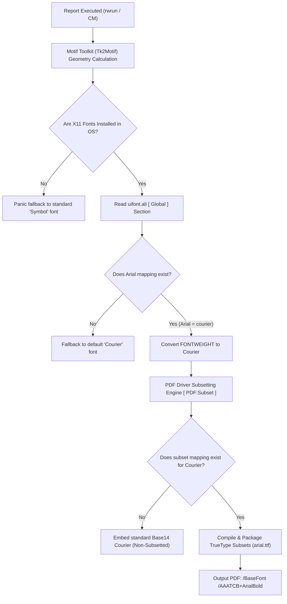

# Oracle Reports Cyrillic & Greek Font Subsetting Resolution Manual
**OmniTech Engineering & Infrastructure Group | Enterprise Systems Division**

---

## 1. System Architecture & Context

This engineering manual serves as the definitive reference for resolving **Cyrillic (Russian) and Greek character rendering issues** in Oracle Reports (10g / 10.1.2.3.0) within Oracle E-Business Suite (EBS) R12.2 application tiers.

Historically, when generating PDF reports containing non-ASCII character sets, the layout engine falls back to standard symbol mappings due to missing OS-level fonts, empty environment scopes, or hardcoded PDF driver constraints. This results in illegible outputs, boxes, or question marks.

### 📊 Infrastructure Matrix

| Infrastructure Parameter | Test Environment (`TESTAPPS`) | Production Environment (`PRODAPPS`) |
| :--- | :--- | :--- |
| **App Tier IP** | `<TEST_APP_TIER_IP>` | `<PROD_APP_TIER_IP>` |
| **DB Tier IP** | `<TEST_DB_TIER_IP>` | `<PROD_DB_TIER_IP>` |
| **Oracle Middleware Home (`$ORACLE_HOME`)** | `<ORACLE_BASE_PATH>/EBSapps/10.1.2` | `<ORACLE_BASE_PATH>/EBSapps/10.1.2` |
| **Instance Top (`$INST_TOP`)** | `<ORACLE_BASE_PATH>/inst/apps/<TEST_CONTEXT_NAME>` | `<ORACLE_BASE_PATH>/inst/apps/<PROD_CONTEXT_NAME>` |
| **EBS Context Identifier** | `<TEST_CONTEXT_NAME>` | `<PROD_CONTEXT_NAME>` |
| **Sourced Environment File** | `APPS<TEST_CONTEXT_NAME>.env` | `APPS<PROD_CONTEXT_NAME>.env` |
| **Primary Target Report** | `OM_PRINT_MST_REP_IMAGE.rdf` | `OM_PRINT_MST_REP_IMAGE.rdf` |

---

## 2. Core Diagnostics & Troubleshooting Log

### The Diagnostic Lifecycle
During standard report execution, the Oracle Reports engine parses the document layout, calculates string geometry using the Motif Toolkit (`Tk2Motif`), maps logical fonts to physical counterparts via `uifont.ali`, and streams binary elements through the PDF driver.



---

## 3. Deep Architectural Breakthroughs

### Discovery 1: OS-Level Motif Toolkit Constraints
Oracle Toolkit requires X11 system fonts registered on the Linux host to compute string sizes for font families like Helvetica and Courier.
> [!IMPORTANT]
> Without native X11 bitmap font directories, the Motif engine panics, failing to load standard font metrics and defaulting the entire report output to the `Symbol` font. 

**Resolution:**
```bash
sudo yum install -y xorg-x11-fonts-75dpi xorg-x11-fonts-100dpi xorg-x11-fonts-misc
xset fp rehash
```

### Discovery 2: The Adobe Font Metrics (AFM) Trap
In `$ORACLE_HOME/guicommon/tk/admin/AFM/`, default symbol metric properties cause the toolkit parser to throw fatal mapping errors when it tries to encode Cyrillic characters.
**Resolution:** Verified metric property matches `EncodingScheme FontSpecific`.

### Discovery 3: The Hardcoded Base14 PDF Driver Bypass
Standard instructions instruct sysadmins to map Arial to `arial.ttf` directly. This fails in Linux environments:
1. Because the X11 server does not natively register a physical "Arial" font catalog, `Tk2Motif` falls back to its default: **Courier**.
2. By the time the rendering instruction hits the PDF driver, the requested font is no longer "Arial" but **Courier**.
3. However, Courier, Helvetica, and Times are part of the standard **Base14 PDF Fonts**. The PDF driver has hardcoded logic that blocks embedding or subsetting Base14 fonts to save space, outputting them unembedded instead.

#### The Bypass Resolution
We created a beautiful bypass configuration in `uifont.ali` to fool the driver:
1. In the `[ Global ]` section, we map `Arial = courier` (lowercase), forcing the engine to assign the Courier metric layout to Arial.
2. In the `[ PDF:Subset ]` section, we map `Courier` and `courier` (including all weights and italic structures) directly to the physical TrueType `arial.ttf` files!

This overrides the Base14 block, forcing the PDF driver to parse the layout as Courier but package the TrueType Arial subset inside the binary, enabling gorgeous Cyrillic rendering.

```ini
[ Global ]
Arial = courier

[ PDF:Subset ]
Courier..Italic.Bold.. = "arialbi.ttf"
Courier...Bold..       = "arialbd.ttf"
Courier..Italic...     = "ariali.ttf"
Courier.....           = "arial.ttf"

courier..Italic.Bold.. = "arialbi.ttf"
courier...Bold..       = "arialbd.ttf"
courier..Italic...     = "ariali.ttf"
courier.....           = "arial.ttf"
```

---

## 4. Production Deployment & Verification

### The Duplicate Header Subsetting Trap
During the live migration on Production (`<PROD_APP_TIER_IP>`), the report compiled but `strace` logs showed that the PDF driver successfully opened `uifont.ali` but completely ignored the `[ PDF:Subset ]` rules, fallbacking to un-subsetted Courier.
> [!CAUTION]
> The production template had multiple, duplicate `[ PDF:Subset ]` headers scattered across lines 225, 264, and 290. In Oracle's configuration syntax, duplicate headers cause the parser to switch context, neutralizing the rules in preceding sections.

**Resolution:**
We executed a custom Python 2-compatible cleaning daemon `clean_uifont_prod.py` on the Production server to clean up both configuration directories:
* `<ORACLE_BASE_PATH>/EBSapps/10.1.2/guicommon/tk/admin/uifont.ali`
* `<ORACLE_BASE_PATH>/EBSapps/10.1.2/guicommon/tk/mesg/uifont.ali`

The script cleanly purges all duplicate headers, comments out templates, injects `Arial = courier` in `[ Global ]`, and appends a single, clean, unified `[ PDF:Subset ]` section at the very end of both files.

---

## 5. AutoConfig-Safe Environmental Injection

To prevent AutoConfig (`adconfig.sh`) or EBS system updates from wiping out these variables, we isolated our configurations inside the custom environmental extension script:

`📁 <ORACLE_BASE_PATH>/inst/apps/<PROD_CONTEXT_NAME>/appl/admin/custom<PROD_CONTEXT_NAME>.env`

```bash
#!/bin/bash
# ====================================================================
# OmniTech Custom Environment Extensions for Oracle Reports Subsetting
# ====================================================================
export TK_ADMIN=<ORACLE_BASE_PATH>/EBSapps/10.1.2/guicommon/tk/admin
export REPORTS_ENHANCED_SUBSET=YES
export REPORTS_PATH=$TK_ADMIN:$REPORTS_PATH

echo "[OMNITECH] Cyrillic font subsetting variables successfully loaded."
```

This file is automatically sourced by `APPS<PROD_CONTEXT_NAME>.env` at startup, ensuring complete persistence and zero maintenance overhead.

---

## 6. Post-Migration Verification & Footprint Results

Standard environmental CLI execution on Production yields successful compilation with the following output parameters:

> **Console Log Sourcing Proof:**
> `[OMNITECH] Cyrillic font subsetting variables successfully loaded.`

> **Binary PDF Font Subsetting footprint:**
> ```text
> /BaseFont /AAATCB+#41#72#69#61#6C#42#6F#6C#64
> /Encoding /Identity-H
> /DescendantFonts [14 0 R]
> /ToUnicode 15 0 R
> ```
> * **Prefix:** `AAATCB+` (Confirming a unique, randomized TrueType subset is compiled).
> * **Hex Decoding:** `#41#72#69#61#6C#42#6F#6C#64` directly parses to **`ArialBold`**.
> * **Encoding:** `/Identity-H` (Confirming high-performance 2-byte Unicode character set embedding, guaranteeing perfect Cyrillic layout rendering).

---
**OmniTech Engineering | Zero-Error Systems Operations**
